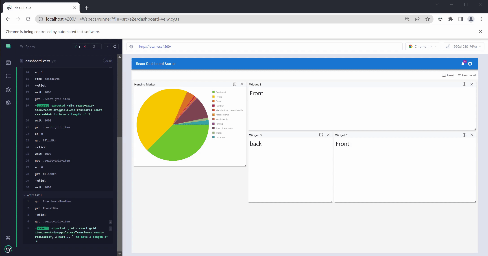
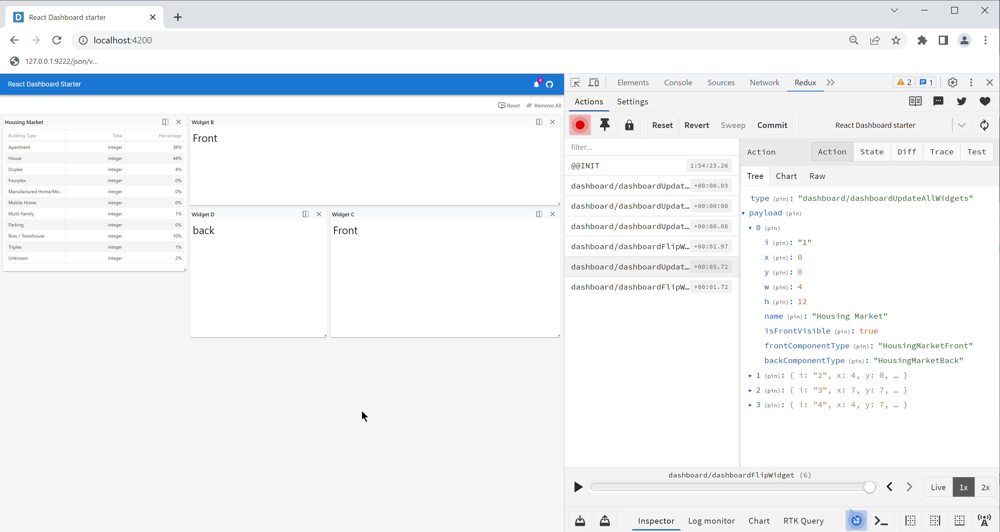

# React Dashboard Starter
**A React dashboard boilerplate project.**

[](https://opensource.org/licenses/MIT)
<a href="https://github.com/j1032w/react-dashboard-starter" target="_blank"></a>
[](https://www.paypal.com/donate/?hosted_button_id=29ZE3URD5V9Q8)

#### The Angular edition of Dashboard Starter can be found at https://github.com/j1032w/dashboard-starter







# Features

- Built with [React 18](https://react.dev/), [Typescript 4](https://www.typescriptlang.org/), [react-redux 7](https://react-redux.js.org/), and [Material UI 5](https://mui.com/)
- [Nx](https://nx.dev/) monorepo structure with [vite](https://vitejs.dev/) builder  
- Integrated [CSS Module](https://github.com/css-modules/css-modules) with [SCSS](https://sass-lang.com/documentation/syntax) 
- Unit testing with [Jest](https://jestjs.io/) and [React Testing Library ](https://testing-library.com/docs/react-testing-library/intro/) 
- E2E automation testing with [Cypress](https://www.cypress.io/)
- [ESlint](https://eslint.org/) and [Prettier](https://prettier.io/)


# Quick start
1. Clone repository
```
git clone https://github.com/j1032w/react-dashboard-starter.git
```
2. Running development server
```
yarn install
yarn start
```
3. Navigate to [http://localhost:4200/](http://localhost:4200/)


# Design


<a title="web stats" href="https://statcounter.com/" target="_blank"></a>
